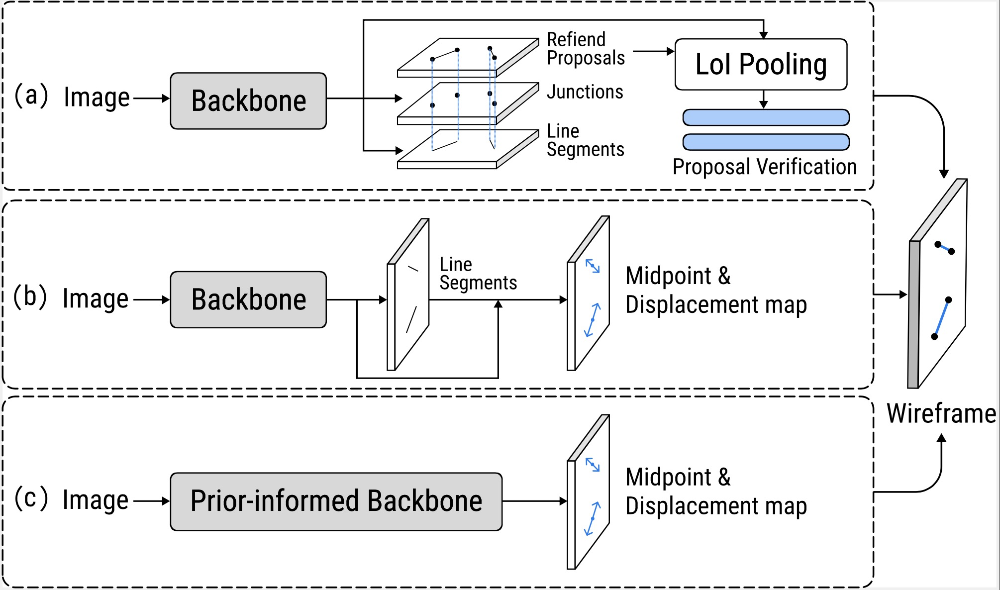

<div align="center">
<h1> WirePAuS: Auxiliary-free Single-shot Wireframe Parsing
 </h1>
</div>

<div align="center">


</div>

<div align="center">
  📃 <a href="https://ieeexplore.ieee.org/document/10688260">Paper</a> |
  📚 <a href="https://github.com/ennauata/buildings2vec">Data</a> |
  📜 <a href="">License</a>
</div>

## 📝 Introduction

Wireframe parsing aims to identify vectorized line segments as pairs of endpoints from an image. Conventional methods usually require field-specific knowledge for manual introduction of auxiliary processes or auxiliary learning tasks towards satisfactory performances. Such pipelines are, however, characterized by high complexity, insignificant efficiency, and limited space for further performance improvement. 

To address these issues, we propose WirePAuS, a novel Wireframe Parser with an Auxiliary-free Single-shot pipeline, which requires no auxiliary processes or auxiliary learning tasks. This is based on its capability to generate appropriate prior information from a prior-informed feature extractor, which incorporates frequency-domain and Hough-domain prior information on line segments in the backbone. Meanwhile, we devise a structurally compact pipeline that enables the parser to directly predict the focal midpoints as line objects and exploit their displacements for the corresponding endpoints. Our end-to-end trainable WirePAuS is capable to capture rich structural details during single-shot inference. Extensive experiments suggest that the proposed method reaches significantly improved performances for wireframe parsing and outperforms a series of state-of-the-art methods.
<div align="center">

</div>

## 🎉 What's New
- **[2024.03.13]** 📣 WirePAuS has been accepted for IEEE Conference on Multimedia Expo 2024!

## 📄 Table of Contents

<details>
<summary>
Click to expand the table of contents
</summary>

- [📝 Introduction](#-introduction)
  - [Diagnostic Framework and Scope](#diagnostic-framework-and-scope)
- [🎉 What's New](#-whats-new)
- [📄 Table of Contents](#-table-of-contents)
- [🔧 Setup Environment](#-setup-environment)
- [📚 Data](#-data)
- [📊 Evaluate Benchmark](#-evaluate-benchmark)
  - [1. Inference](#1-inference)
  - [2. Evaluation](#2-evaluation)
- [🔁 Reproduction](#-reproduction)
- [📖 Citation](#-citation)

</details>

## 🔧 Setup Environment

```shell
conda create -n wirepaus python=3.10
conda activate wirepaus
pip install -r requirements.txt
```

## 📚 Data

You can download the whole evaluation data through the following command from <a href="https://github.com/ennauata/buildings2vec">this repository</a>:

## 📊 Evaluate Benchmark

### 1. Inference


### 2. Evaluation


## 📖 Citation

If you find this repository useful, please consider giving star and citing our paper:

```plaintext

@inproceedings{ji2024wirepaus,
  title={WirePAuS: Auxiliary-free Single-shot Wireframe Parsing},
  author={Ji, Jinkang and Shen, Junao and Wang, Xinyu and Feng, Tian and Wu, Sensen},
  booktitle={2024 IEEE International Conference on Multimedia and Expo (ICME)},
  year={2024},
  url={https://ieeexplore.ieee.org/document/10688260},
}
```
